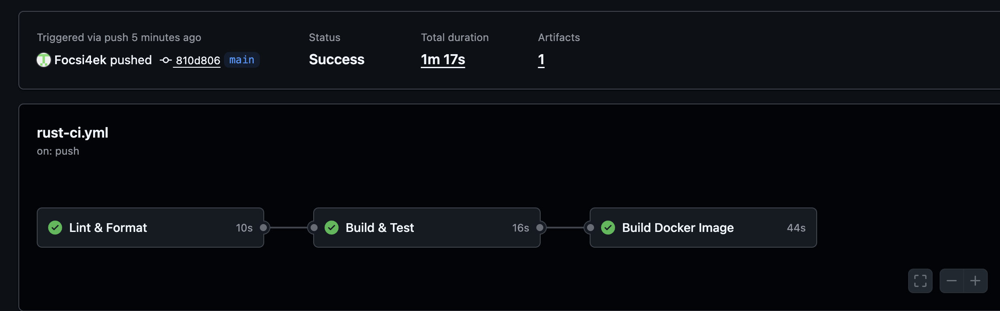
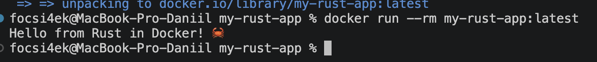

# 🦀 Rust CI Pipeline with GitHub Actions

**Автор:** Абрамов Даниил Сергеевич

Учебный проект для изучения **Continuous Integration (CI)** на примере приложения на Rust.

Проект автоматически проверяется через **GitHub Actions**: выполняется форматирование кода, статический анализ с помощью Clippy, проверка и сборка приложения, запуск тестов, сборка Docker-образа, его проверочный запуск и сохранение готового Docker-образа как CI-артефакта.

---

## 🎯 Цель проекта

Основная цель — построить полноценный CI Pipeline для Rust-приложения и познакомиться с автоматической проверкой и контейнеризацией проекта.

В рамках работы реализованы:

- автоматический запуск CI при push
- запуск CI при Pull Request
- ручной запуск workflow
- проверка форматирования Rust-кода
- статический анализ через Clippy
- проверка исходного кода через Cargo
- Debug-сборка
- Release-сборка
- запуск тестов
- multi-stage Docker build
- запуск приложения в Docker
- использование непривилегированного пользователя
- Docker Buildx
- кэширование Docker-сборки
- сохранение Docker-образа как GitHub Actions Artifact

---

## 🛠️ Используемые технологии

| Технология | Назначение |
|---|---|
| 🦀 Rust | Основной язык приложения |
| 📦 Cargo | Сборка и управление Rust-проектом |
| 🔍 Clippy | Статический анализ кода |
| 🎨 rustfmt | Проверка форматирования |
| ⚙️ GitHub Actions | Автоматизация CI |
| 🐳 Docker | Контейнеризация приложения |
| 🏗️ Docker Buildx | Расширенная сборка Docker-образа |
| 📦 GitHub Artifacts | Хранение собранного Docker-образа |
| Git | Контроль версий |
| GitHub | Хранение исходного кода |

---

## 📁 Структура проекта

    my-rust-app/
    ├── .github/
    │   └── workflows/
    │       └── rust-ci.yml
    │
    ├── src/
    │   └── main.rs
    │
    ├── Cargo.toml
    ├── Cargo.lock
    ├── Dockerfile
    ├── .dockerignore
    ├── .gitignore
    ├── README.md
    ├── 01-github-actions-success.png
    └── 02-docker-run-success.png

---

# 🦀 Приложение

Основной код находится в:

    src/main.rs

Программа выводит сообщение:

    Hello from Rust in Docker! 🦀

Основной код приложения:

    use std::io::{self, Write};

    fn main() {
        println!("Hello from Rust in Docker! 🦀");

        io::stdout().flush().unwrap();

        std::thread::sleep(std::time::Duration::from_millis(200));
    }

После вывода выполняется принудительный сброс буфера stdout, чтобы сообщение гарантированно отображалось при запуске внутри контейнера.

---

# 📦 Cargo

Для управления проектом используется стандартный инструмент Rust:

**Cargo**

Он отвечает за:

- сборку проекта
- управление зависимостями
- запуск тестов
- статическую проверку
- Release-сборку
- создание Cargo.lock

Основная конфигурация находится в:

    Cargo.toml

---

## ⚙️ Cargo.toml

Проект использует:

    [package]
    name = "my-rust-app"
    version = "0.1.0"
    edition = "2021"

Для Release-сборки дополнительно настроена оптимизация:

    [profile.release]
    lto = true
    codegen-units = 1
    opt-level = 3

---

## 🔒 Cargo.lock

Файл:

    Cargo.lock

фиксирует точные версии зависимостей Rust-проекта.

Это позволяет получать воспроизводимые сборки как локально, так и внутри GitHub Actions.

В проекте он был создан через Docker:

    docker run --rm \
      -v "$(pwd):/app" \
      -w /app \
      rust:1-slim \
      cargo generate-lockfile

Rust при этом не требуется устанавливать непосредственно на macOS.

---

# 🎨 rustfmt

Для проверки форматирования Rust-кода используется:

**rustfmt**

Проверка:

    cargo fmt --all -- --check

Если код отформатирован неправильно, CI Pipeline останавливается.

Локально rustfmt использовался через Docker:

    docker run --rm \
      -v "$(pwd):/app" \
      -w /app \
      rust:1-slim \
      sh -c "rustup component add rustfmt && cargo fmt --all"

Проверить форматирование можно командой:

    docker run --rm \
      -v "$(pwd):/app" \
      -w /app \
      rust:1-slim \
      sh -c "rustup component add rustfmt && cargo fmt --all -- --check"

---

# 🔍 Clippy

Для статического анализа используется:

**Clippy**

Он помогает находить:

- потенциальные ошибки
- неоптимальные конструкции
- плохие практики
- подозрительные выражения
- проблемы со стилем Rust-кода

В CI используется:

    cargo clippy -- -D warnings

Параметр:

    -D warnings

превращает предупреждения в ошибки.

Таким образом Pipeline не пропускает код с предупреждениями Clippy.

---

# ✅ Cargo Check

Перед полноценной сборкой выполняется быстрая проверка:

    cargo check --verbose

Cargo проверяет:

- синтаксис
- типы
- зависимости
- корректность исходного кода

При этом полноценный бинарный файл ещё не создаётся.

Локальная проверка через Docker:

    docker run --rm \
      -v "$(pwd):/app" \
      -w /app \
      rust:1-slim \
      cargo check

---

# 🏗️ Сборка приложения

GitHub Actions выполняет две разновидности сборки.

### Debug Build

    cargo build --verbose

Используется для стандартной разработки и проверки проекта.

### Release Build

    cargo build --release --verbose

Release-сборка включает оптимизации и предназначена для production-использования.

Готовый бинарник создаётся в:

    target/release/my-rust-app

---

# 🧪 Тестирование

Для запуска тестовой системы Rust используется:

    cargo test --verbose

Локально:

    docker run --rm \
      -v "$(pwd):/app" \
      -w /app \
      rust:1-slim \
      cargo test

Команда проверяет тестовую конфигурацию проекта и завершает Pipeline ошибкой, если какой-либо тест не проходит.

---

# ⚙️ GitHub Actions

Workflow находится по пути:

    .github/workflows/rust-ci.yml

Название:

    Rust CI Pipeline

Pipeline запускается автоматически при:

    push

и:

    pull_request

для веток:

    main
    master

Также предусмотрен ручной запуск:

    workflow_dispatch

Это позволяет запускать Pipeline непосредственно из интерфейса GitHub.

---

# 🔄 CI Pipeline

Общая архитектура:

    Developer
        │
        │ git push
        ▼
    GitHub Repository
        │
        ▼
    GitHub Actions
        │
        ▼
    ┌──────────────────────────────┐
    │        Lint & Format         │
    │                              │
    │  rustfmt                     │
    │  Clippy                      │
    └──────────────┬───────────────┘
                   │
                   │ Success
                   ▼
    ┌──────────────────────────────┐
    │        Build & Test          │
    │                              │
    │  cargo check                 │
    │  Debug Build                 │
    │  Release Build               │
    │  cargo test                  │
    └──────────────┬───────────────┘
                   │
                   │ Success
                   ▼
    ┌──────────────────────────────┐
    │      Build Docker Image      │
    │                              │
    │  Docker Buildx               │
    │  Build Image                 │
    │  Save Artifact               │
    │  Test Container              │
    └──────────────┬───────────────┘
                   │
                   ▼
               ✅ Success

---

# 🔗 Зависимости между Jobs

В проекте jobs выполняются последовательно.

Первый этап:

    lint

После него:

    test

Зависимость:

    needs: lint

А Docker-сборка зависит от успешного тестирования:

    needs: test

Таким образом:

    Lint & Format
          ↓
    Build & Test
          ↓
    Docker Build

Если любой предыдущий этап завершается ошибкой, следующие jobs не запускаются.

---

# 🐳 Docker

Для контейнеризации Rust-приложения используется multi-stage Docker build.

Это позволяет использовать большой Rust-образ только для компиляции и не включать компилятор Rust в итоговый контейнер.

---

## 🏗️ Docker Architecture

    ┌────────────────────────────┐
    │        rust:1-slim         │
    │                            │
    │       Builder Stage        │
    └──────────────┬─────────────┘
                   │
                   ▼
           cargo build --release
                   │
                   ▼
             my-rust-app
                   │
                   ▼
    ┌────────────────────────────┐
    │    debian:stable-slim      │
    │                            │
    │       Runtime Stage        │
    └──────────────┬─────────────┘
                   │
                   ▼
               appuser
                   │
                   ▼
          ./my-rust-app

---

# 🐳 Dockerfile

Рабочий Dockerfile проекта:

    FROM rust:1-slim AS builder

    WORKDIR /app

    COPY Cargo.toml Cargo.lock ./
    COPY src ./src

    RUN cargo build --release

    FROM debian:stable-slim

    RUN useradd --create-home appuser

    WORKDIR /home/appuser

    COPY --from=builder /app/target/release/my-rust-app .

    USER appuser

    CMD ["./my-rust-app"]

---

## 🔐 Непривилегированный пользователь

В runtime-контейнере создаётся отдельный пользователь:

    appuser

После чего приложение запускается от его имени:

    USER appuser

Это безопаснее, чем запускать приложение от root.

---

# 🚫 .dockerignore

Чтобы лишние файлы не попадали в Docker build context, используется:

    target/
    .git/
    .github/
    .gitignore
    .dockerignore
    *.md
    *.log
    Dockerfile

Это уменьшает объём данных, передаваемых Docker при сборке.

---

# 🚫 .gitignore

В Git не добавляются:

    /target/
    **/*.rs.bk
    *.swp
    /.idea/
    *.iml

Каталог:

    target/

может занимать значительный объём и содержит локальные результаты сборки, поэтому хранить его в Git не требуется.

---

# 🔨 Локальная сборка Docker

Собрать образ:

    docker build -t my-rust-app:latest .

При необходимости полностью отключить старый кэш:

    docker build --no-cache -t my-rust-app:latest .

Проверить наличие образа:

    docker images | grep my-rust-app

---

# ▶️ Запуск контейнера

Запуск приложения:

    docker run --rm my-rust-app:latest

Результат:

    Hello from Rust in Docker! 🦀

Параметр:

    --rm

автоматически удаляет контейнер после завершения работы.

---

# 💻 Интерактивный режим

В контейнер можно войти через Bash:

    docker run -it --rm --entrypoint /bin/bash my-rust-app:latest

После этого можно изучить:

- файловую систему
- пользователя
- установленное окружение
- содержимое runtime-образа

Выход:

    exit

---

# 🏗️ Docker Buildx

В GitHub Actions используется:

    docker/setup-buildx-action@v3

Docker Buildx предоставляет расширенные возможности сборки и позволяет использовать кэш GitHub Actions.

---

# ⚡ Docker Cache

В workflow настроено:

    cache-from: type=gha
    cache-to: type=gha,mode=max

Это позволяет GitHub Actions сохранять промежуточные слои Docker-сборки.

При последующих запусках Pipeline часть работы может быть выполнена быстрее за счёт повторного использования кэша.

---

# 📦 Docker Image Artifact

После сборки Docker-образ сохраняется в TAR-файл:

    docker save my-rust-app:latest -o /tmp/docker-image.tar

Затем архивируется:

    gzip /tmp/docker-image.tar

Получается:

    docker-image.tar.gz

GitHub Actions сохраняет его как Artifact:

    docker-image

Срок хранения:

    7 дней

Таким образом готовый Docker-образ можно скачать непосредственно со страницы выполнения Workflow.

---

# 🧪 Проверка Docker-образа внутри CI

GitHub Actions не ограничивается только сборкой.

После создания образа выполняется:

    docker run --rm my-rust-app:latest

Это проверяет, что контейнер действительно запускается и приложение внутри него работает.

---

# 🖥️ Результат GitHub Actions

После push автоматически запускается весь Pipeline.

Успешно должны завершиться:

- Lint & Format — ✅
- Build & Test — ✅
- Build Docker Image — ✅
- Docker Artifact — ✅
- Test Docker Image — ✅

---

# 🐳 Результат локального запуска

Docker-образ успешно собирается и запускается локально:

    docker run --rm my-rust-app:latest

Результат:

    Hello from Rust in Docker! 🦀

---

# ✅ Что проверяет CI

| Этап | Инструмент |
|---|---|
| Получение исходного кода | actions/checkout |
| Установка Rust | Rust Toolchain |
| Форматирование | rustfmt |
| Статический анализ | Clippy |
| Проверка кода | cargo check |
| Debug-сборка | cargo build |
| Release-сборка | cargo build --release |
| Тестирование | cargo test |
| Docker Builder | Docker Buildx |
| Сборка контейнера | Docker |
| Сохранение образа | upload-artifact |
| Проверочный запуск | docker run |

---

# 📌 Continuous Integration

Continuous Integration позволяет автоматически проверять каждое новое изменение проекта.

Разработчику достаточно выполнить:

    git push

После этого GitHub Actions самостоятельно запускает:

    Checkout
        ↓
    Rust Setup
        ↓
    rustfmt
        ↓
    Clippy
        ↓
    cargo check
        ↓
    Debug Build
        ↓
    Release Build
        ↓
    cargo test
        ↓
    Docker Build
        ↓
    Save Artifact
        ↓
    Run Container
        ↓
      ✅ Success

---

# 🔁 Повторный запуск Pipeline

После изменения кода:

    git add .
    git commit -m "Update Rust application"
    git push

Новый CI Pipeline запускается автоматически.

При необходимости его также можно запустить вручную через:

**GitHub → Actions → Rust CI Pipeline → Run workflow**

---

# 📚 Полученные навыки

В ходе проекта были освоены:

- настройка CI для Rust
- работа с GitHub Actions
- создание Rust-проекта
- использование Cargo
- работа с Cargo.toml и Cargo.lock
- форматирование через rustfmt
- статический анализ через Clippy
- cargo check
- Debug и Release сборки
- автоматическое тестирование
- работа с Rust через Docker
- multi-stage Docker build
- создание минимального runtime-образа
- запуск контейнера от непривилегированного пользователя
- использование Docker Buildx
- кэширование Docker-сборок
- сохранение Docker-образа как Artifact
- создание зависимых GitHub Actions jobs

---

# 🎯 Итог

В проекте создан полноценный учебный **CI Pipeline для Rust-приложения**.

GitHub Actions автоматически проверяет форматирование и качество кода, выполняет Debug и Release сборки, запускает тестирование, создаёт Docker-образ, сохраняет его как Artifact и проверяет запуск готового контейнера.

Итоговая схема:

    Code
      ↓
    Format
      ↓
    Clippy
      ↓
    Check
      ↓
    Build
      ↓
    Test
      ↓
    Docker Build
      ↓
    Artifact
      ↓
    Container Test
      ↓
    ✅ Success

Проект демонстрирует практический пример построения CI Pipeline для Rust с использованием **GitHub Actions, Cargo и Docker**.

---

## 👨‍💻 Автор

**Абрамов Даниил Сергеевич**

**Rust CI Pipeline © 2026**